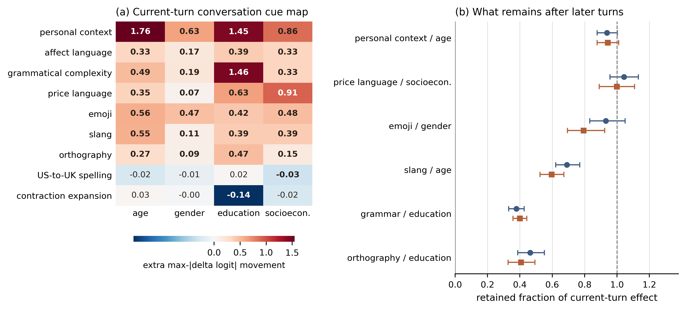
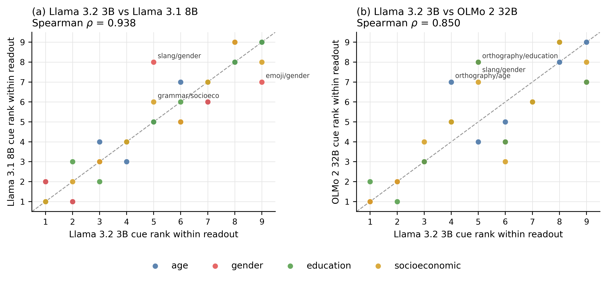

# Results

The repository contains complete runs for Llama 3.2 3B, Llama 3.1 8B, and
OLMo 2 32B. Each model has its own five-seed, full-conversation probe ensemble.
The primary estimate averages two independently worded current-turn shells and
the five probe seeds, then subtracts random-synonym movement for the same base
message. Confidence intervals use 5,000 base-cluster bootstrap draws;
two-sided tests use 10,000 base-cluster sign flips; q-values apply
Benjamini--Hochberg correction across all 36 cells.

## Full 3B cue map

Thirty of 36 cue-by-readout cells survive correction in the 1,025-pair run.
Twenty-eight are above the matched lexical-edit floor; the two negative cells
are contraction-expansion→education and US-to-UK-spelling→socioeconomic
status.

| Cue | Readout | Extra movement | 95% CI | Five-seed range |
|---|---|---:|---:|---:|
| Personal context | Age | 1.756 | [1.517, 2.003] | [1.332, 2.175] |
| Grammatical complexity | Education | 1.458 | [1.233, 1.680] | [0.447, 2.474] |
| Personal context | Education | 1.448 | [1.185, 1.726] | [0.442, 2.363] |
| Price language | Socioeconomic status | 0.915 | [0.774, 1.053] | [0.691, 1.362] |
| Personal context | Socioeconomic status | 0.860 | [0.721, 1.005] | [0.652, 1.297] |
| Emoji | Age | 0.565 | [0.479, 0.655] | [0.404, 0.854] |
| Slang | Age | 0.547 | [0.438, 0.675] | [0.341, 0.794] |
| Orthography | Education | 0.474 | [0.379, 0.573] | [0.043, 1.180] |

Numerical logit effects are comparable among cues within one readout, not
between separately fitted readouts or models.

## Cross-model agreement

The cross-model analysis uses a shared 505-pair panel. Comparisons use cue
ranks computed separately within each readout, signs, corrected significance,
and dimensionless retention ratios. Raw logits from independently fitted
probes are not assumed to share a calibrated unit.

| Model compared with Llama 3.2 3B | Pooled rank rho | Per-readout range | Same sign | Still q<.05 |
|---|---:|---:|---:|---:|
| Llama 3.1 8B | .938 | .850-.983 | 30/30 | 29/30 |
| OLMo 2 32B | .850 | .817-.900 | 30/30 | 29/30 |

All 60 held-out probe tests exceed the `.75` balanced-accuracy gate. Personal
context and slang occupy the top two age positions in all three models. Price
and personal context occupy the top two socioeconomic positions. Gender varies
more: emoji ranks first at 3B and third at 8B and 32B.

## Within-model robustness

The two shell rankings correlate `.971`, `.967`, and `.992` in the full 3B
run, 8B, and 32B. The three readout-phrase correlations range `.892-.929`,
`.883-.933`, and `.875-.921`, respectively. Ranks are computed within each
readout. The ordering is similar, but magnitude is partly elicitation-dependent.

## Persistence

| Cue / readout, two turns later | 3B panel | 8B | 32B |
|---|---:|---:|---:|
| Personal context / age | .98 | .98 | .90 |
| Price / socioeconomic status | 1.01 | 1.15 | .69 |
| Emoji / gender | .79 | 1.45 | .76 |
| Slang / age | .57 | .47 | .51 |
| Grammar / education | .43 | .46 | .66 |
| Orthography / education | .41 | .42 | .23 |

Personal-context age movement persists in every model. Slang and
orthographic effects attenuate consistently; price, emoji, and grammar have more
model-dependent time courses. Bootstrap intervals for every cell are in the
per-model summaries. In the full 3B estimate, the six ratios are `.94`,
`1.00`, `.79`, `.60`, `.40`, and `.41` in the table's row order.

## Artifacts

- `llama3b/`: row-level deltas and the aggregate analysis for all 1,025 pairs.
- `cross_model/llama3b/`, `cross_model/llama8b/`, and
  `cross_model/olmo32b/`: row-level deltas and summaries for the shared panel.
- `cross_model/summary.json`: cross-model comparisons and the complete
  probe-quality gate report.
- `fig_conversation_sensitivity.{pdf,png}` and
  `fig_cross_model.{pdf,png}`: publication figures in vector and web formats.
